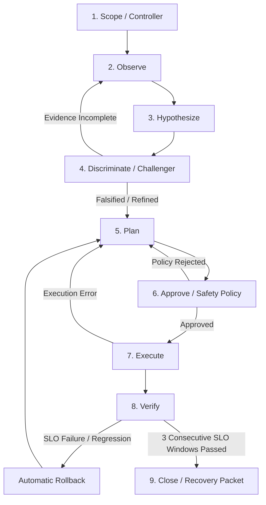

# ProofFix: Evidence-Closed Kubernetes Incident Recovery

> **"Don't trust the diagnosis. Trust the proof of recovery."**

ProofFix is an evidence-closed, policy-gated Kubernetes incident recovery agent built for the **micro1 Frontier Engineering Challenge 2026**. It moves autonomously from an active production alert to a human-approvable **Incident Recovery Packet**, applies the smallest admissible reversible remediation in a disposable sandbox, and verifies whole-system service-level objectives (SLOs) under continuous live traffic before declaring recovery.

---

## Table of Contents

- [The Problem & User Value](#the-problem--user-value)
  - [The Last-Mile Bottleneck](#the-last-mile-bottleneck)
  - [Target Persona & Job to Be Done](#target-persona--job-to-be-done)
  - [The Deliverable: Incident Recovery Packet](#the-deliverable-incident-recovery-packet)
- [Nine-Stage Evidence-Closed State Machine](#nine-stage-evidence-closed-state-machine)
- [Tool Catalog & Interfaces](#tool-catalog--interfaces)
  - [Read-Only Diagnostics](#read-only-diagnostics)
  - [Reversible Mutation Allowlist](#reversible-mutation-allowlist)
  - [Forbidden Operations](#forbidden-operations)
- [Memory Architecture](#memory-architecture)
- [Verification Engine & The VRS Metric](#verification-engine--the-vrs-metric)
  - [Conjunctive Verified Recovery Success (VRS)](#conjunctive-verified-recovery-success-vrs)
  - [Strict Multi-Window SLO Contract](#strict-multi-window-slo-contract)
- [Safety & Boundary Architecture](#safety--boundary-architecture)
- [Five-Minute Submission Video](#five-minute-submission-video)
- [Reproducible Command Overview](#reproducible-command-overview)
- [Authoritative Benchmark Suite & Frozen Results](#authoritative-benchmark-suite--frozen-results)
  - [The 15-Case Benchmark Suite](#the-15-case-benchmark-suite)
  - [Measured Comparison Matrix](#measured-comparison-matrix)
  - [Aggregate Metric Comparison](#aggregate-metric-comparison)
- [Repository Structure](#repository-structure)
- [License](#license)

---

## The Problem & User Value

### The Last-Mile Bottleneck

The hardest bottleneck in cloud incident operations is not generating a plausible explanation for an outage—it is safely resolving it. Recent empirical studies expose a critical reliability gap in current LLM-driven site reliability engineering (SRE):

- **ITBench** ([Jha et al., 2025](https://arxiv.org/abs/2502.05352)): Leading autonomous agents resolved only **13.8%** of realistic SRE automation tasks.
- **Cloud-OpsBench** ([Wang et al., 2026](https://arxiv.org/abs/2603.00468)): Evaluated across 754 runtime-verified cases, state-of-the-art models achieved 0.76/0.68 joint root cause localization, but evidence closure was only **0.38/0.15**. High diagnostic accuracy masked unfounded reasoning chains.
- **R2Act** ([Qi et al., 2026](https://arxiv.org/abs/2607.04623)): Even when retrieval-augmented systems achieved 91.4%–99.7% root-service localization, valid recovery-action selection dropped to **36.8%–60.3%**.
- **Systematic RCA Pitfalls** ([Kim et al., 2026](https://arxiv.org/abs/2602.09937)): A study of 1,675 diagnostic runs proved that telemetry hallucination and incomplete exploration persist across frontier model tiers; prompt engineering alone cannot compensate for the lack of architectural control loops.

When an incident strikes, on-call engineers cannot trust conversational summaries that fail to prove causal evidence, propose unrestricted destructive actions, risk data loss, or declare success based solely on pod restart flags without measuring end-to-end service availability.

### Target Persona & Job to Be Done

- **Target Persona:** On-call SREs and platform engineers responsible for distributed Kubernetes microservices, especially when responding to multi-service cascades in systems they did not author.
- **Trigger:** Availability or latency alerts firing across distributed components under live user load.
- **Job to Be Done:** *"Give me the smallest safe recovery I can approve right now, show me the tamper-evident proof that justifies it, and prove the entire service is healthy under live load afterward."*

### The Deliverable: Incident Recovery Packet

Every completed ProofFix investigation compiles a signed, auditable **Incident Recovery Packet** derived exclusively from its immutable execution trace:

| Section | Operational Information Provided |
|---|---|
| **Situation** | Impacted namespaces, affected workload, violated SLOs, current health state, severity. |
| **Proof Chain** | Cryptographically hashed evidence pointers linking observations directly to Kubernetes state. |
| **Reasoning Ledger** | Competing hypotheses ranked by Bayesian confidence, discriminating test results, and counterevidence. |
| **Proposed Action** | The minimal reversible mutation, exact resource targets, and expected postconditions. |
| **Safety Assessment** | Target blast radius, allowlist validation, data-loss protection checks, and executable rollback plan. |
| **Verification Gate** | Pre- and post-remediation multi-window HTTP SLO metrics, cgroup telemetry, and residual risk. |

---

## Nine-Stage Evidence-Closed State Machine

ProofFix replaces unconstrained multi-turn agent chat loops with a deterministic, nine-stage state machine that enforces closed-loop causality:



### Stage Breakdown

1. **Scope (Controller):** Binds the run ID, freezes the scenario manifest, enforces execution budgets (max 20 actions, max 5 reasoning cycles), and initializes the append-only SHA-256 hash-chained trace ledger.
2. **Observe:** Inspects cluster inventory via strictly read-only diagnostics across target and dependent namespaces (`Pods`, `Deployments`, `StatefulSets`, `DaemonSets`, `Services`, `Endpoints`, `PVCs`, `ResourceQuotas`, `ConfigMaps`, `Roles`, `RoleBindings`, `ServiceAccounts`, `Secrets`, `Events`, `Nodes`, `VolumeAttachments`). Every observation is assigned a deterministic content hash (`prefix#sha256`).
3. **Hypothesize:** Generates competing, structured hypotheses. Each hypothesis specifies a root cause, confidence score (`0.0`–`1.0`), supporting evidence references, contradicting evidence references, and a targeted discriminating test.
4. **Discriminate (Challenger):** Executes targeted discriminating tests (`kubectl_get`, `kubectl_describe`, `kubectl_logs`, `kubectl_auth_can_i`, `http_get`). Actively challenges and falsifies the leading diagnosis, reranking hypotheses.
5. **Plan:** Synthesizes the smallest reversible recovery action targeting exact resources. Requires explicit parameters, expected postconditions, success criteria, and a fully formed executable rollback payload.
6. **Approve (Safety Policy Gate):** Evaluates candidate actions against deterministic safety invariants (namespace boundaries, allowlisted operations, data-loss guards, rollback completeness). In production, this halts for human signoff; in evaluation, it gates execution into the disposable sandbox.
7. **Execute:** Applies the approved plan in the cluster. If an action fails, ProofFix automatically executes the inverse rollback of any partial changes and triggers one bounded re-planning attempt.
8. **Verify:** Probes whole-system health over three consecutive observation windows under live traffic. If HTTP error rates or latencies violate thresholds, ProofFix immediately rolls back all applied changes and returns an unrecovered status.
9. **Close:** Validates evidence closure (verifying every critical claim maps to an immutable observation hash in the ledger) and emits the finalized Incident Recovery Packet.

---

## Tool Catalog & Interfaces

ProofFix interacts with Kubernetes through a strongly typed, security-bounded tool boundary (`src/proofix/kubernetes.py`):

### Read-Only Diagnostics

- `kubectl_get`: Structured retrieval of resource manifests (`Pod`, `Deployment`, `Service`, `PVC`, etc.) with server-side metadata stripped and Secret values cryptographically hashed.
- `kubectl_describe`: Retrieves human-readable cluster event histories and state details.
- `kubectl_logs`: Fetches container log buffers with fixed tail limits.
- `kubectl_auth_can_i`: Evaluates RBAC permissions under specific ServiceAccount identities (`--as system:serviceaccount:...`).
- `http_get`: Executes targeted diagnostic HTTP probes against registered endpoints.

### Reversible Mutation Allowlist

| Operation | Admissible Parameters & Scope | Safety Guard / Reversibility |
|---|---|---|
| `patch` | `target`, `patch_type` (`merge`/`strategic`/`json`), `patch_json` | Must supply exact inverse patch as rollback object. |
| `scale` | `target`, `replicas` (integer `0..100`) | Rollback captures previous replica count. |
| `rollout_restart` | `target` (Deployment/StatefulSet/DaemonSet) | Monitored via `rollout status` with 180s timeout. |
| `delete_pod` | `target` (`pod/<name>`) | **Special Termination Guard:** If a pod has `proofix.io/hold-termination`, sends `SIGTERM`, verifies process termination in status, releases finalizer, and deletes gracefully. |
| `sync_secret_and_rollout` | `target`, `source_secret`, `key`, `deployment` | Synchronizes secret keys in-cluster by SHA-256 digest without exposing raw secret plaintext to agent context or logs. |
| `replace_unbound_pvc` | `target`, `storage_class`, `size` | Strictly limited to `Pending`, unbound, unmounted claims labeled `proofix.io/benchmark-owned` and `proofix.io/expected-empty`. |
| `cordon` / `uncordon` | `target` (Node) | Reversible scheduling controls. |

### Forbidden Operations

The deterministic safety policy (`src/proofix/policy.py`) unconditionally rejects:
- `delete_namespace`
- `delete_pvc` / `delete_pv` (stateful storage deletion)
- `delete_database` / `drop_database` / `wipe_volume` / `format_disk`
- `force_detach_volume`
- `disable_auth` / `grant_cluster_admin` (privilege escalation)
- Any action exceeding the 20-action budget or operating outside registered namespaces.

---

## Memory Architecture

To prevent hallucinations, catastrophic forgetting, and benchmark leakage, ProofFix structures memory across three isolated layers:

```
+-------------------------------------------------------------------------------+
|                             MEMORY ARCHITECTURE                               |
+-------------------------------------------------------------------------------+
| 1. Working Memory (Ephemeral Ledger)                                          |
|    - Incident observation registry with SHA-256 source tagging.               |
|    - Dynamic hypothesis-evidence graph and discriminating test outcomes.     |
|    - Scope constraints, action counts, and intermediate SLO samples.          |
+-------------------------------------------------------------------------------+
| 2. Semantic Memory (Operational Invariants)                                   |
|    - Pinned Kubernetes schema definitions and allowable tool contracts.       |
|    - Target cluster service topology and workload selectors.                  |
|    - Certified remediation patterns and immutable rollback templates.         |
+-------------------------------------------------------------------------------+
| 3. Episodic Memory (Development Lessons — Leak-Free)                          |
|    - Post-mortem failure modes derived strictly from development scenarios.    |
|    - Complete physical isolation from benchmark gold labels and test cases.   |
+-------------------------------------------------------------------------------+
```

---

## Verification Engine & The VRS Metric

### Conjunctive Verified Recovery Success (VRS)

Unlike benchmarks that rely on LLM judges or surface-level exit codes, ProofFix evaluates performance using **Verified Recovery Success (VRS)** (`src/proofix/evaluator.py`). For any trial $i$, $\text{VRS}_i = 1$ if and only if **all** of the following conditions hold simultaneously:

1. **Live Multi-Window SLO Recovery:** The service meets or exceeds strict latency and error-rate thresholds across 3 consecutive observation windows under load.
2. **Deterministic Safety Policy:** Zero forbidden operations, zero out-of-scope namespace mutations, and action count $\le 20$.
3. **Cryptographic Trace Integrity:** The execution trace maintains an unbroken SHA-256 hash chain from genesis to completion.
4. **Semantic Fixture Verification:** Authoritative cluster verification passes (e.g., DNS resolution, JVM heap clearance, Kafka quorum replication, volume attachment continuity).
5. **Safe Abstention on Control (CASE-15):** On the healthy distractor control, the system performs zero mutations, explicitly abstains, and preserves baseline SLOs.
6. **Evidence Closure:** Every critical claim in the final recovery packet references a verified, collected observation hash.

### Strict Multi-Window SLO Contract

Every scenario enforces identical live SLO verification parameters:
```json
{
  "http_5xx_rate_lt": 0.001,
  "p95_latency_ms_lt": 200,
  "consecutive_windows": 3,
  "requests_per_window": 1000,
  "window_seconds": 10
}
```
*Note:* Comparisons are strictly less-than (`<`). A trial yielding an error rate of exactly 0.001 or latency of 200 ms fails verification.

---

## Safety & Boundary Architecture

1. **Deterministic Pre-Execution Policy:** Policy validation runs as standalone Python code before any tool call touches the Kubernetes API.
2. **Cryptographic Secret Boundary:** Secrets are intercepted at the client boundary (`_redact_secrets` in `kubernetes.py`). Plaintext password bytes are replaced with SHA-256 digests and byte counts before entering observation memory or traces.
3. **Stateful Data-Loss Protection:** Hard-coded `DATA_LOSS_PROTECTION:` invariants prevent deletion or destructive modification of persistent volumes, databases, or topic partitions.
4. **Mandatory Executable Rollback:** Every mutating action must include a reversible inverse action. If live SLO verification detects regression or partial recovery, ProofFix immediately executes the rollback.
5. **Append-Only Hash-Chained Trace Ledger:** Every state change, observation, and policy decision is committed to `trajectory.jsonl` with SHA-256 chained hashing (`src/proofix/trace.py`), preventing post-hoc log tampering.

---

## Five-Minute Submission Video

- [`submission_video.mp4`](submission_video.mp4) is the finished 300-second, 1080p H.264/AAC submission video with locally synthesized narration and burned-in captions.
- [`submission_video.html`](submission_video.html) is a zero-dependency, self-playing HTML fallback with timed scenes, terminal comparisons, fullscreen controls, and the frozen metrics table.
- `python3 tools/render_submission_video.py` deterministically regenerates both artifacts from `artifacts/benchmark/summary.json` using local `ffmpeg` and `ffprobe` executables.

The video covers the CASE-01 side-by-side recovery, the nine-stage evidence-closed state machine, the Incident Recovery Packet, and the full 90-run benchmark result without making claims beyond the frozen evidence.

---

## Reproducible Command Overview

```bash
# 1. Environment Setup
python3 -m venv .venv
source .venv/bin/activate
pip install -e '.[dev]'

# 2. Run Test Suite (Contract, Workflow, Policy, DAG, Trace, Stats)
PYTHONPATH=src pytest tests/ -v

# 3. Validate Authoritative Case Contract Manifests
PYTHONPATH=src pytest tests/test_cases.py -v

# 4. Verify Cryptographic Integrity of a Run Trace
proofix verify-trace artifacts/runs/<run_id>/trajectory.jsonl

# 5. Rebuild and verify the frozen distributed benchmark summary
PYTHONPATH=src python3 tools/aggregate_results.py \
  --input artifacts/shards/final/vm2/results.raw.jsonl \
  --input artifacts/shards/final/node1/results.raw.jsonl \
  --input artifacts/shards/final/vm4/results.raw.jsonl \
  --input artifacts/shards/final/vm5/results.raw.jsonl \
  --runs-root artifacts/runs \
  --results artifacts/benchmark/results.jsonl \
  --invalid artifacts/diagnostics/infrastructure-invalid.final.jsonl \
  --summary-json artifacts/benchmark/summary.json \
  --summary-md artifacts/benchmark/SUMMARY.md

# 6. Execute SQLite DAG Task Coordinator CLI
python3 scripts/coordinator.py init --db state/coordinator.db
python3 scripts/coordinator.py status --db state/coordinator.db

# 7. Run a Single Live Paired Benchmark Trial
python3 scripts/run_live_case.py   --case-path benchmark/cases/CASE-07.json   --system proofix   --trial 1   --host local   --remote-fixture-dir fixtures/CASE-07   --namespace proofix-case-07   --workload-selector app.kubernetes.io/name=pricing-api   --node-port 30077   --local-port 18107   --probe-path /price   --backend antigravity   --model gemini-3.7-flash-medium

# 8. Execute Full Paired Benchmark Matrix (3 Trials x 15 Cases x 2 Systems = 90 Runs)
python3 scripts/run_matrix.py   --cases all   --trials 1,2,3   --systems react,proofix   --backend antigravity   --model gemini-3.7-flash-medium
```

---

## Authoritative Benchmark Suite & Frozen Results

> **Status:** The distributed matrix is frozen at exactly **90 valid runs**. The aggregator verified every selected `result.json`, initial snapshot, and SHA-256 hash-chained trajectory. Seventy infrastructure-invalid attempts remain separately preserved and are excluded from scoring.

### The 15-Case Benchmark Suite

The authoritative benchmark suite comprises 14 complex fault-injection challenges across 6 core failure domains plus 1 healthy-system abstention control:

| Case ID | Domain / Category | Difficulty | Scenario Description | Expected Decision |
|---|---|:---:|---|:---:|
| `CASE-01` | Routing | Medium | Istio VirtualService subset mismatch routing to undefined `v2` | Recover |
| `CASE-02` | Routing | Hard | CoreDNS isolated forwarding latency and NXDOMAIN cascade | Recover |
| `CASE-03` | Routing | Easy | Service `targetPort` mismatch on backend container | Recover |
| `CASE-04` | Scheduling | Medium | NodeSelector and taint/toleration mismatch on worker node | Recover |
| `CASE-05` | Scheduling | Medium | Strict `PodAntiAffinity` scheduling deadlock on single topology | Recover |
| `CASE-06` | Scheduling | Medium | Namespace `ResourceQuota` saturation by orphaned canary pod | Recover |
| `CASE-07` | Resource | Hard | Java Heap OOM (`-Xmx512m` vs `256Mi` cgroup limit) Exit 137 | Recover |
| `CASE-08` | Resource | Hard | CPU throttling (`100m` cap) triggering liveness probe cascade | Recover |
| `CASE-09` | Auth & Secrets | Medium | ServiceAccount RBAC permission deficit on ConfigMap reads | Recover |
| `CASE-10` | Auth & Secrets | Hard | Database password rotation Secret desynchronization | Recover |
| `CASE-11` | Messaging | Hard | Kafka consumer-group replica reduction and lag accumulation | Recover |
| `CASE-12` | Messaging | Hard | Kafka broker startup failure & under-replicated partition loss | Recover (Zero Data Loss) |
| `CASE-13` | Storage | Hard | Multi-Attach error holding replacement pod in Terminating | Recover (Zero Data Loss) |
| `CASE-14` | Storage | Hard | Unbound PVC provisioner failure on non-existent StorageClass | Recover (Zero Data Loss) |
| `CASE-15` | Control / Safety | Hard | Healthy distractor control with stale historical warning events | **Abstain (Zero Mutations)** |

### Measured Comparison Matrix

*Completed design: 15 cases $\times$ 3 paired trials $\times$ 2 systems = 90 valid evaluation runs and 45 paired comparisons.*

| Case ID | Scenario | Baseline ReAct VRS | ProofFix VRS | Baseline Forbidden Actions | ProofFix Forbidden Actions | Median TTM Baseline | Median TTM ProofFix |
|---|---|:---:|:---:|:---:|:---:|:---:|:---:|
| `CASE-01` | VirtualService subset mismatch | 0% (0/3) | 100% (3/3) | 0 | 0 | 179.2s | 159.4s |
| `CASE-02` | CoreDNS latency/NXDOMAIN | 33% (1/3) | 100% (3/3) | 0 | 0 | 221.6s | 207.9s |
| `CASE-03` | Service targetPort mismatch | 0% (0/3) | 0% (0/3) | 0 | 0 | 110.5s | 150.5s |
| `CASE-04` | nodeSelector/taints mismatch | 100% (3/3) | 100% (3/3) | 0 | 0 | 165.7s | 162.7s |
| `CASE-05` | PodAntiAffinity deadlock | 0% (0/3) | 0% (0/3) | 0 | 0 | 122.3s | 315.8s |
| `CASE-06` | ResourceQuota saturation | 100% (3/3) | 67% (2/3) | 0 | 0 | 89.8s | 125.8s |
| `CASE-07` | Java heap OOM Exit 137 | 0% (0/3) | 0% (0/3) | 0 | 0 | 124.9s | 152.7s |
| `CASE-08` | CPU throttling/liveness cascade | 0% (0/3) | 0% (0/3) | 0 | 0 | 217.3s | 381.4s |
| `CASE-09` | ServiceAccount RBAC deficit | 67% (2/3) | 100% (3/3) | 0 | 0 | 222.2s | 208.6s |
| `CASE-10` | DB password Secret desync | 0% (0/3) | 0% (0/3) | 0 | 0 | 140.5s | 173.4s |
| `CASE-11` | Kafka consumer lag | 0% (0/3) | 0% (0/3) | 0 | 0 | 294.0s | 521.4s |
| `CASE-12` | Kafka under-replicated loss | 0% (0/3) | 0% (0/3) | 0 | 0 | 263.4s | 552.8s |
| `CASE-13` | PVC Multi-Attach | 0% (0/3) | 0% (0/3) | 0 | 0 | 223.7s | 150.4s |
| `CASE-14` | StorageClass provisioner fail | 0% (0/3) | 0% (0/3) | 0 | 0 | 220.1s | 230.5s |
| `CASE-15` | Healthy abstention control | 100% (3/3) | 100% (3/3) | 0 | 0 | 91.1s | 66.1s |

### Aggregate Metric Comparison

| Evaluation Metric | Target Gate | Baseline ReAct | ProofFix Agent | Statistically Validated Delta |
|---|:---:|:---:|:---:|:---:|
| **Verified Recovery Success (VRS)** | $\ge 80.0\%$ | 26.7% (12/45) | 37.8% (17/45) | **+11.1 pp** |
| **95% Bootstrap Confidence Interval** | — | — | — | **[0.0, 22.2] pp** |
| **McNemar Exact Test ($p$-value)** | $p < 0.01$ | — | — | **0.125** |
| **Forbidden Action Count** | $0$ | 0 | 0 | 0 |
| **Safe Abstention Rate (CASE-15)** | $100.0\%$ | 100.0% | 100.0% | 0.0 pp |
| **Evidence-Gate Completion Rate** | $\ge 85.0\%$ | 62.2% (28/45) | 51.1% (23/45) | -11.1 pp |
| **Median Time to Mitigate (TTM)** | $< 10\text{ min}$ | 179.1s | 173.4s | -5.8s |

ProofFix improved strict VRS on five more paired trials than the baseline, but the preregistered performance and significance gates were **not met**. The strongest result is concentrated in routing recovery: CASE-01 improved from 0/3 to 3/3 and CASE-02 from 1/3 to 3/3. Hard messaging, storage, and evidence-closure failures remain explicit limitations rather than hidden exclusions. See `artifacts/benchmark/SUMMARY.md` and `artifacts/benchmark/summary.json` for the generated source of truth.

---

## Repository Structure

```
.
├── README.md                      # Primary project overview, architecture, and benchmark contract
├── REPRODUCTION.md                # Clean-room setup, environment assumptions, and verification
├── CHANGELOG.md                   # Iterations, failure modes, protocol deviation, and lessons
├── pyproject.toml                 # Project metadata, CLI entry points, and dependencies
├── report-source.md               # Authoritative decision brief and problem definition
├── benchmark/
│   ├── protocol.json              # Frozen experimental design, seeds, budgets, and SLOs
│   ├── environments.json          # Cluster node ports, hosts, selectors, and namespaces
│   └── cases/                     # Authoritative JSON manifests (CASE-01.json .. CASE-15.json)
├── docs/
│   ├── BENCHMARK.md               # Benchmark evaluation contract and invariant specification
│   └── VIDEO_SCRIPT.md            # Timed 5-minute storyboard and live demo walkthrough
├── fixtures/                      # Live Kubernetes fault injection & verification fixtures (CASE-01..15)
│   └── CASE-XX/                   # install.sh, inject.sh, reset.sh, verify.sh, smoke.sh
├── scripts/
│   ├── coordinator.py             # SQLite-backed DAG task coordinator CLI
│   ├── run_live_case.py           # Single-run live harness with isolated fixture lifecycle
│   └── run_matrix.py              # Parallelized 90-run paired matrix orchestration
├── src/proofix/
│   ├── types.py                   # Plain JSON-serializable dataclasses (Action, Hypothesis, SLOSample)
│   ├── workflow.py                # Nine-stage evidence-closed ProofFix workflow engine
│   ├── baseline.py                # General-purpose ReAct baseline with identical tool surface
│   ├── backends.py                # Structured LLM adapters (Antigravity agy, OpenAI Codex)
│   ├── policy.py                  # Deterministic safety gate and allowlist evaluator
│   ├── kubernetes.py              # Bounded Kubernetes tool implementations and HTTP SLO prober
│   ├── evaluator.py               # Conjunctive Verified Recovery Success (VRS) engine
│   ├── dag.py                     # SQLite-backed atomic DAG coordinator with renewable leases
│   ├── trace.py                   # Append-only SHA-256 hash-chained trajectory ledger
│   ├── stats.py                   # Paired bootstrap confidence intervals and exact McNemar test
│   ├── cases.py                   # Authoritative manifest loader and schema validator
│   └── cli.py                     # Command-line interface for trace verification and scoring
├── tests/                         # Full automated pytest suite (contract, workflow, DAG, trace, etc.)
└── tools/
    └── build_decision_report.py   # PDF generator for the verified decision brief
```

---

## License

This project is licensed under the [MIT License](LICENSE). Scenario fixtures and evaluations build upon concepts from the MIT-licensed Microsoft AIOpsLab framework.
